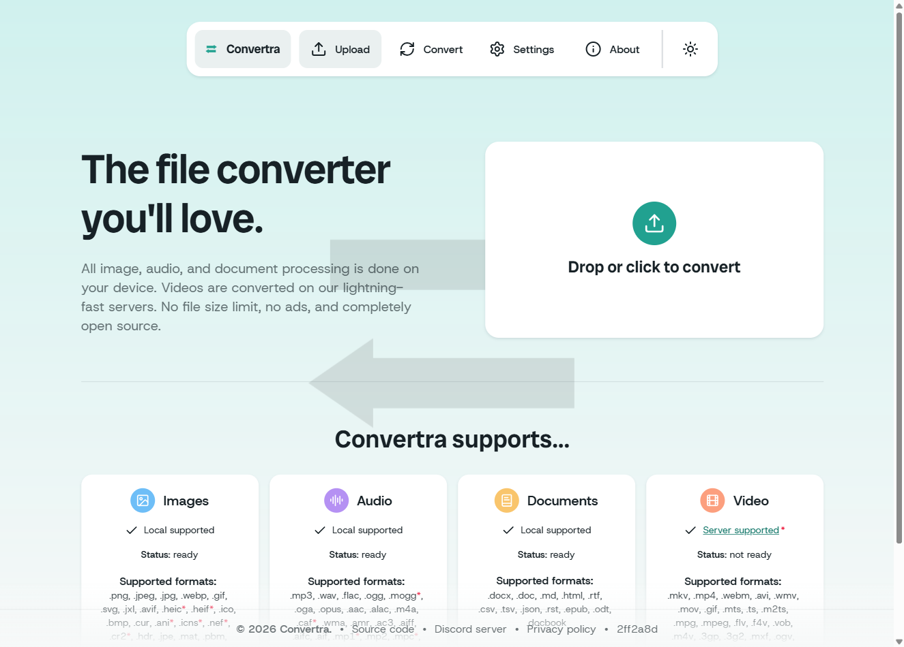
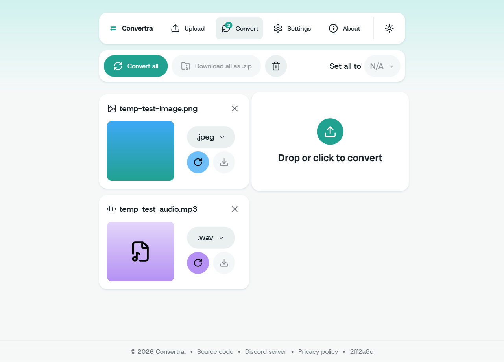

<p align="center">
  
</p>
<h1 align="center">Convertra</h1>

Convertra is a **privacy-first, fully client-side file converter**. It converts files on your device using WebAssembly — nothing is uploaded to a server.

Convertra keeps the "no upload, runs in your browser" promise across images,
audio, and documents, and goes further: **full PDF support**
(merge/split/compress/text/image) and **client-side video → GIF/WebM** via
WebCodecs.

Convertra is built in Svelte and TypeScript.

## Screenshots

|                        Upload page                        |                        Conversion page                        |
| :-------------------------------------------------------: | :-----------------------------------------------------------: |
|  |  |

## Features

- Convert files directly on your device using WebAssembly\*
- No file or file size limits (bounded by available device memory)
- Convert images, audio, documents, and video\*
- Supports over **250+** file formats
- **PDF tooling**: merge, split, compress, extract text/markdown, and render to
  image — all client-side
- **Video → GIF / WebM** fully client-side (WebCodecs) for short clips
- Conversion settings
- User-friendly interface built with Svelte

<sup>\* Non-local video conversion is available with our official instance, but
the [daemon](https://github.com/vibecoder11200/vertd) is easily self-hostable to
maintain privacy and fully local functionality. Convertra adds a fully
client-side video → GIF/WebM path for short clips, and falls back to vertd for
everything else.</sup>

## Setup

Requires [bun](https://bun.sh) ≥ 1.3 (pinned in CI via `oven-sh/setup-bun`).

```bash
cp .env.example .env   # then edit
bun install
bun run dev            # or: bun run build && bun run preview
```

### Environment variables

All public config is `PUB_*` prefixed (see `.env.example`):

| Variable                              | Purpose                                                     |
| ------------------------------------- | ----------------------------------------------------------- |
| `PUB_HOSTNAME`                        | Hostname for analytics tracking (Plausible)                 |
| `PUB_PLAUSIBLE_URL`                   | Plausible instance URL (empty disables analytics)           |
| `PUB_ENV`                             | `development`, `production`, or `nightly`                   |
| `PUB_VERTD_URL`                       | URL of the vertd daemon for video conversion                |
| `PUB_DISABLE_ALL_EXTERNAL_REQUESTS`   | `true` disables vertd/Stripe/Plausible (privacy/air-gapped) |
| `PUB_DISABLE_FAILURE_BLOCKS`          | `true` disables blocking repeated failed video conversions  |
| `PUB_DONATION_URL` / `PUB_STRIPE_KEY` | Donation links (Stripe)                                     |

## Documentation

- [FAQ](./docs/FAQ.md)
- [Getting Started](./docs/GETTING_STARTED.md)
- [Using Docker](./docs/DOCKER.md)
- [Video Conversion](./docs/VIDEO_CONVERSION.md)

## License

See [LICENSE](LICENSE).
